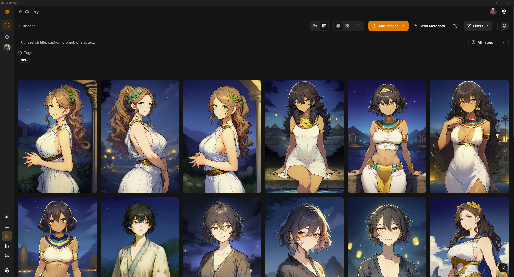
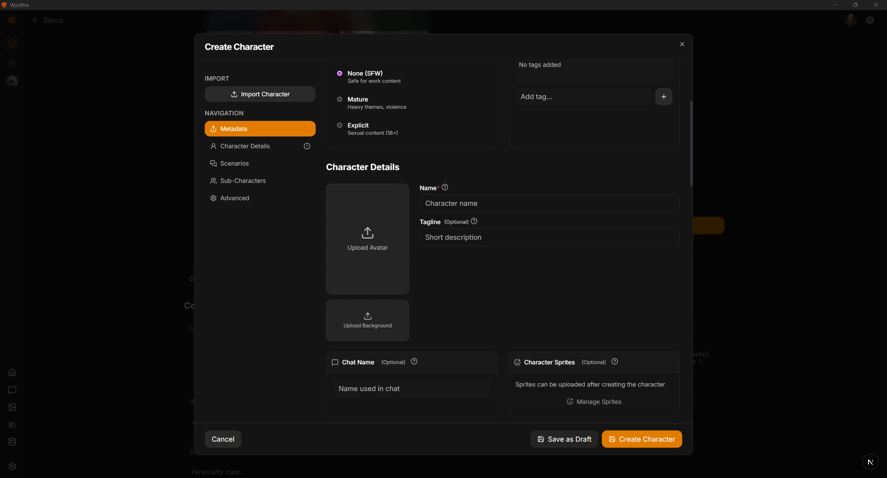
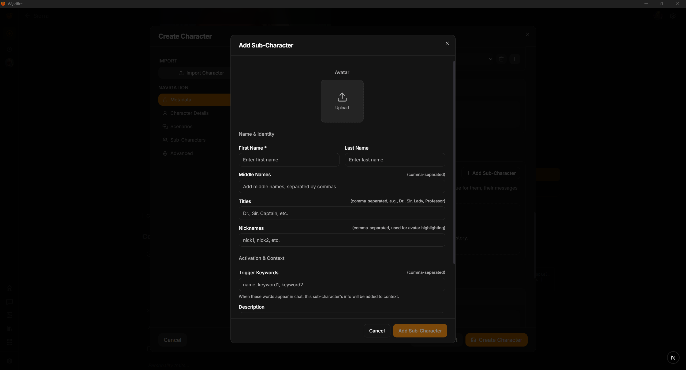
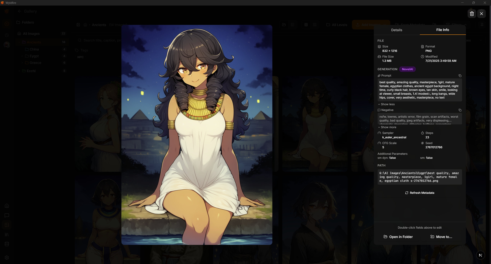
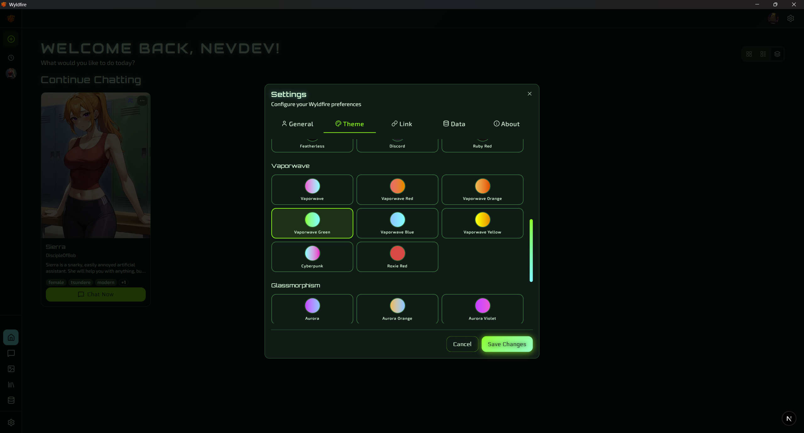

# Wyldfire

<div align="center">
  
  
  <h3>Your Characters, Your Data, Your Rules</h3>
  
  <p>The official desktop companion application for <a href="https://app.wyvern.chat">WyvernChat</a></p>
  
  [](https://discord.gg/wyvernchat)
  [](https://wyldfire.ai)
  
  [Website](https://wyldfire.ai) • [Downloads](#-downloads) • [Features](#-features) • [Documentation](#-documentation) • [Discord](https://discord.gg/wyvernchat)
</div>

---

## 📖 About

Wyldfire is a native desktop application that brings the full [WyvernChat](https://app.wyvern.chat) experience to your desktop with enhanced privacy, offline capabilities, and local data storage. Built with [Tauri](https://tauri.app/) and React, Wyldfire provides a fast, secure, and beautiful interface for managing your character library and AI conversations.

### Why Wyldfire?

- **🔒 Privacy First**: All your data is stored locally in a SQLite database
- **📴 Offline Capable**: Access your characters and chat history without internet
- **⚡ Native Performance**: Built with Rust and Tauri for blazing-fast performance
- **🎨 Beautiful UI**: Modern, customizable interface with multiple themes
- **🔄 WyvernChat Sync**: Seamlessly import characters from the WyvernChat platform
- **🤖 AI Integration**: Connect to various AI providers or run models locally

---

## ✨ Features

### Character Management
- **📚 Character Library**: Organize your characters with a beautiful, searchable library
- **✏️ Character Editor**: Create and edit characters with full metadata support
- **👥 Sub-Characters & NPCs**: Add supporting characters with trigger keywords and descriptions
- **🎭 User Personas**: Create multiple personas to represent yourself in chats
- **📦 Import/Export**: Import from WyvernChat, JSON files, or create your own

### Image & Gallery
- **🖼️ Image Gallery**: Manage character images, sprites, and backgrounds locally
- **📁 Folder Sync**: Sync folders from your local filesystem
- **🔍 AI Metadata Viewer**: View and search AI-generated image metadata and prompts
- **🎨 Sprite System**: Full support for visual novel-style sprite sets with emotion states

### Chat & AI
- **💬 AI Chat Integration**: Connect to various AI providers (OpenAI, Anthropic, OpenRouter, etc.)
- **🌐 Local Models**: Support for running AI models locally (planned)
- **📝 Chat History**: All conversations stored locally with full search
- **⚙️ Advanced Settings**: Fine-tune generation parameters and prompts

### Customization
- **🎨 Themes**: Multiple beautiful themes (Vaporwave, Glassmorphism, and more)
- **🖥️ View Modes**: Switch between different layout modes
- **⚡ Performance**: Optimized for speed with native desktop performance

---

## 📥 Downloads

> **Note**: Wyldfire is currently in development. Downloads will be available soon.

### Supported Platforms

| Platform | Status | Download |
|----------|--------|----------|
| 🪟 Windows | Coming Soon | - |
| 🍎 macOS | Coming Soon | - |
| 🐧 Linux | Coming Soon | - |
| 🤖 Android | Planned | - |
| 📱 iOS | Planned | - |

Join our [Discord server](https://discord.gg/wyvernchat) to get notified when downloads become available.

---

## 🚀 Getting Started

### Installation

1. Download the appropriate installer for your platform from the [releases page](https://github.com/WyChatTeam/Wyldfire-releases/releases)
2. Run the installer and follow the on-screen instructions
3. Launch Wyldfire and start importing your characters!

### First Steps

1. **Import Characters**: Import from WyvernChat or create your own
2. **Set Up AI**: Configure your preferred AI provider
3. **Customize**: Choose your theme and layout preferences
4. **Start Chatting**: Begin conversations with your characters

---

## 📚 Documentation

### Quick Links
- [Installation Guide](docs/installation.md) *(Coming Soon)*
- [User Guide](docs/user-guide.md) *(Coming Soon)*
- [Character Creation](docs/character-creation.md) *(Coming Soon)*
- [AI Configuration](docs/ai-configuration.md) *(Coming Soon)*
- [Troubleshooting](docs/troubleshooting.md) *(Coming Soon)*

### Key Concepts

#### Local Storage
All your data is stored locally in a SQLite database located in your user data directory. Your characters, chats, and settings never leave your device unless you choose to sync them.

#### WyvernChat Integration
Wyldfire can import characters directly from the WyvernChat platform. Simply log in with your WyvernChat account to access your cloud library.

#### Offline Mode
Wyldfire works completely offline. You can create characters, manage your library, and even chat with AI models (when using local models) without an internet connection.

---

## 🛠️ Technical Details

### Built With

- **[Tauri](https://tauri.app/)** - Lightweight, secure desktop framework
- **[React 19](https://react.dev/)** - Modern UI framework
- **[Next.js](https://nextjs.org/)** - React framework for production
- **[SQLite](https://www.sqlite.org/)** - Local database
- **[Rust](https://www.rust-lang.org/)** - Secure, performant backend

### Architecture

```
Wyldfire
├── Frontend (React + Next.js)
│   ├── Character Library UI
│   ├── Chat Interface
│   ├── Gallery Manager
│   └── Settings & Customization
│
└── Backend (Rust + Tauri)
    ├── SQLite Database
    ├── File System Management
    ├── AI Provider Integration
    └── Native OS Integration
```

---

## 🤝 Contributing

We welcome contributions! However, please note that Wyldfire is currently in closed development. Once we open-source the project, we'll provide contribution guidelines.

For now, you can:
- Report bugs via [GitHub Issues](https://github.com/WyChatTeam/Wyldfire-releases/issues)
- Request features via [GitHub Discussions](https://github.com/WyChatTeam/Wyldfire-releases/discussions)
- Join our [Discord](https://discord.gg/wyvernchat) for community support

---

## 🔗 Related Projects

### WyvernChat
The web-based AI chat platform that Wyldfire complements. Visit [app.wyvern.chat](https://app.wyvern.chat) to explore thousands of community-created characters.

### Featherless AI
Wyldfire and WyvernChat are powered by [Featherless AI](https://featherless.ai), a serverless AI inference platform providing instant access to 6,700+ open-source AI models.

---

## 📊 Comparison: Web vs Desktop

| Feature | WyvernChat Web | Wyldfire Desktop |
|---------|----------------|------------------|
| Character Browsing | ✅ | ✅ |
| AI Chat | ✅ | ✅ |
| Offline Access | ❌ | ✅ |
| Local Data Storage | ❌ | ✅ |
| No Account Required | ❌ | ✅ |
| Community Features | ✅ | Via Sync |
| Character Publishing | ✅ | Via Sync |
| Native Performance | ❌ | ✅ |
| Local AI Models | ❌ | Planned |

---

## 📸 Screenshots

<div align="center">
  
  <p><em>Beautiful, organized image gallery with folder sync</em></p>
  
  
  <p><em>Familiar character editor interface</em></p>
  
  
  <p><em>Easy sub-character and NPC management</em></p>
  
  
  <p><em>AI image metadata viewer and search</em></p>
  
  
  <p><em>Beautiful customizable themes</em></p>
</div>

---

## ❓ FAQ

### Is Wyldfire free?
Yes! Wyldfire is completely free to download and use.

### Do I need a WyvernChat account?
No, you can use Wyldfire completely standalone. However, a WyvernChat account allows you to sync characters from the platform.

### What AI providers are supported?
Wyldfire supports OpenAI, Anthropic, OpenRouter, and other popular providers. Local model support is planned.

### Is my data private?
Absolutely. All your data is stored locally on your device. Nothing is sent to our servers unless you explicitly choose to sync with WyvernChat.

### Can I use Wyldfire offline?
Yes! Wyldfire works completely offline for character management and local chats.

---

## 💬 Support

- **Discord**: Join our [Discord server](https://discord.gg/wyvernchat) for community support
- **Issues**: Report bugs on [GitHub Issues](https://github.com/WyChatTeam/Wyldfire-releases/issues)
- **Email**: support@wyvern.chat *(Coming Soon)*

---

## 🙏 Acknowledgments

- Built by the [Featherless AI](https://featherless.ai) team
- Powered by the amazing [Tauri](https://tauri.app/) framework
- Community feedback from [WyvernChat](https://app.wyvern.chat) users

---

<div align="center">
  <p>Made with 🔥 by the WyvernChat team</p>
  <p>
    <a href="https://wyldfire.ai">Website</a> •
    <a href="https://discord.gg/wyvernchat">Discord</a> •
    <a href="https://app.wyvern.chat">WyvernChat</a> •
    <a href="https://featherless.ai">Featherless AI</a>
  </p>
</div>
